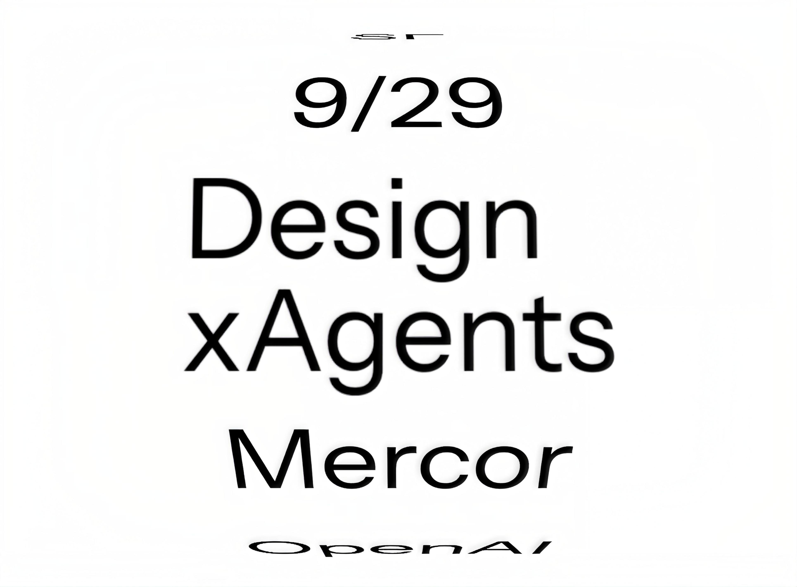

# Design xAgents

Design xAgents brings designers together to share what they are building with agents.

This is the resource guide for **DxA** events. Keep track of agents, MCPs, and skills for designers, along with the tools and research behind working product prototypes.

Rooted in Silicon Valley product craft. Open to designers everywhere.

[Events](events/README.md) · [Directory](resources/README.md) · [Agents](resources/agents.md) · [MCPs](resources/mcps.md) · [Skills](resources/skills.md) · [Shaders](resources/shaders.md) · [Typography](resources/typography.md)

## Next event

**September 29, 2026 · San Francisco · 6–8 PM PDT**

Experiments and demos with [Christopher Sim](events/2026-09-29-san-francisco.md#featured-people), [Tom Krcha](events/2026-09-29-san-francisco.md#featured-people), [Michal Simkovic](events/2026-09-29-san-francisco.md#featured-people), and more. Presented by Mercor.

[Event details and people](events/2026-09-29-san-francisco.md) · [Registration and current availability](https://luma.com/g4vhqudr)

## Start here

The expanded guide includes **151 external skill entries across 18 sections**, plus agents, MCPs, rendering libraries, font tools, and our local design research. [See the coverage audit](resources/catalogue-audit.md). Entries are references, not a claim that every tool is installed or tested.

| What you want to do | Explore |
| --- | --- |
| Design on an editable canvas with an agent | [Paper](resources/agents.md#paper), [Pen.dev](resources/agents.md#pendev) |
| Connect an assistant to your design system | [Figma MCP](resources/mcps.md#figma) |
| Explore interface directions | [Superdesign](resources/agents.md#superdesign) |
| Generate images and video for a product | [fal skills](resources/skills.md#fal) |
| Review and refine an interface | [Impeccable](resources/skills.md#impeccable) |
| Make a product walkthrough | [Remotion](resources/skills.md#remotion) |

These are starting points selected for their documented design workflows. Each entry states its requirements and evidence. Inclusion is not a comparative test result.

## Agents and MCPs

[Paper](https://paper.design/docs/mcp), [Pen.dev](https://www.pen.dev/), [Muse](https://github.com/simota/agent-skills/tree/main/muse), [Superdesign](https://github.com/superdesigndev/superdesign-skill), [Onlook](https://github.com/onlook-dev/onlook), [Open Design](https://github.com/nexu-io/open-design), and [Dyad](https://github.com/dyad-sh/dyad).

Connect design work through [Figma](https://developers.figma.com/docs/figma-mcp-server/), [Canva](https://www.canva.dev/docs/apps/mcp/), [Webflow](https://developers.webflow.com/mcp/reference/overview), [Penpot](https://github.com/penpot/penpot/blob/develop/docs/mcp/index.md), [shadcn/ui](https://ui.shadcn.com/docs/mcp), and [Playwright](https://github.com/microsoft/playwright-mcp). [Framer](https://www.framer.com/agents/external/) also offers a native agent connection.

[All agents and workspaces](resources/agents.md) · [All MCPs and connections](resources/mcps.md)

## Product design skills

| Design work | Repositories and full section |
| --- | --- |
| Interface and brand | [Impeccable](https://github.com/pbakaus/impeccable), [UI Craft](https://github.com/educlopez/ui-craft), [Taste](https://github.com/Leonxlnx/taste-skill) · [All](resources/skills.md#interface-and-brand) |
| Components and platforms | [Design Tokens](https://github.com/ilikescience/design-tokens-skill), [Color Expert](https://github.com/meodai/skill.color-expert), [Apple HIG](https://github.com/raintree-technology/hig-doctor) · [All](resources/skills.md#components-and-platforms) |
| Interaction and navigation | [Interaction Design](https://github.com/rastian/interaction-design-skills), [Interface Design](https://github.com/Dammyjay93/interface-design), [Make Interfaces Better](https://github.com/jakubkrehel/make-interfaces-feel-better) · [All](resources/skills.md#interaction-and-navigation) |
| Figma and code | [Stitch skills](https://github.com/google-labs-code/stitch-skills), [Claude2Figma](https://github.com/senlindesign/claude2figma), [Extract Design System](https://github.com/arvindrk/extract-design-system) · [All](resources/skills.md#figma-and-design-to-code) |
| Accessibility and QA | [UI Skills](https://github.com/ibelick/ui-skills), [Web Quality Skills](https://github.com/addyosmani/web-quality-skills), [Accessibility Agents](https://github.com/Community-Access/accessibility-agents) · [All](resources/skills.md#accessibility-and-quality) |
| Critique and operations | [gstack](https://github.com/garrytan/gstack), [Designer Skills](https://github.com/Owl-Listener/designer-skills), [Service Blueprint](https://github.com/j-clegg/service-blueprint-skill) · [All](resources/skills.md#critique-and-design-operations) |
| Research and product | [Cookiy](https://github.com/cookiy-ai/user-research-skill), [Product Manager Skills](https://github.com/deanpeters/Product-Manager-Skills), [Lenny Skills](https://github.com/RefoundAI/lenny-skills) · [Research](resources/skills.md#user-research) · [Product](resources/skills.md#product-strategy) |
| Writing and content | [UX Writing](https://github.com/content-designer/ux-writing-skill), [Copywriting](https://github.com/judicael-s/Copywriting-skill) · [Content](resources/skills.md#content-design) · [Email](resources/skills.md#email) |

## Motion, shaders, and typography

| Design work | Repositories and full section |
| --- | --- |
| Motion and video | [GSAP skills](https://github.com/greensock/gsap-skills), [Remotion](https://github.com/remotion-dev/skills), [LottieFiles](https://github.com/lottiefiles/motion-design-skill) · [All motion skills](resources/skills.md#motion-and-animation) |
| Shaders and WebGL | [Paper Shaders](https://github.com/paper-design/shaders), [Three.js](https://github.com/mrdoob/three.js), [OGL](https://github.com/oframe/ogl), [ShaderVine](https://github.com/jonradoff/shadervine) · [Full graphics directory](resources/shaders.md) |
| Glass, fluids, and particles | [Drei](https://github.com/pmndrs/drei), [Spectral Glass](https://github.com/Saqoosha/Spectral-Glass), [WebGL Fluid Simulation](https://github.com/PavelDoGreat/WebGL-Fluid-Simulation) · [Glass](resources/shaders.md#glass-and-refraction) · [Simulation](resources/shaders.md#fluids-and-particles) |
| WebGL typography | [Troika](https://github.com/protectwise/troika), [Scroll Rig](https://github.com/14islands/r3f-scroll-rig), [VFX-JS](https://github.com/fand/vfx-js) · [Text effects and articles](resources/typography.md) |
| Font tools and agents | [AI Font Assistant](https://github.com/mixfont/ai-font-assistant), [Fontra](https://github.com/fontra/fontra), [Fontmake](https://github.com/googlefonts/fontmake), [FontBakery](https://github.com/fonttools/fontbakery) · [Full font directory](resources/typography.md#font-agents-and-production-tools) |
| Creative media | [fal skills](https://github.com/fal-ai-community/skills), [Recraft](https://www.recraft.ai/), [FLORA](https://flora.ai/), [Spline](https://spline.design/) · [All creative tools](resources/creative-tools.md) |

## Diagrams, data, and demos

[Excalidraw diagrams](https://github.com/coleam00/excalidraw-diagram-skill), [AntV chart skills](https://github.com/antvis/chart-visualization-skills), [Slidev](https://github.com/slidevjs/slidev), and [Frontend Slides](https://github.com/zarazhangrui/frontend-slides).

[Diagrams and wireframes](resources/skills.md#diagrams-and-wireframes) · [Data visualization](resources/skills.md#data-visualization) · [Presentations](resources/skills.md#presentations) · [Terminal interfaces](resources/skills.md#terminal-interfaces) · [Platform collections](resources/skills.md#platform-collections)

## From our local research

Glass Lab, procedural shader backgrounds, Silk and Lumen studies, image-to-shader research, point and contour experiments, Core font tooling, and scroll-driven WebGL text are now indexed with their public sources and implementation lessons.

[Local study register](resources/local-studies.md) · [DxA typography source](website/src/three-text-demo.js) · [Workflow recipes](workflows/README.md) · [Updates](resources/updates.md)

This publishes the research summaries and source links. It does not redistribute private project code or third-party artwork.

## Product craft

DxA focuses on the work of building products with agents: exploring an idea, making a working prototype, using real components, designing clear agent interactions, and preparing a useful demo.

We look for editable output, thoughtful interaction states, accessible interfaces, and workflows that leave the designer in control.

## Use with your assistant

Browse the guide directly, or give your assistant this README and a task:

> Use Design xAgents to help me choose tools for an editable product prototype. Start with the tools I already have. Explain what each adds, what it requires, and what has been tested.

For assistants that support Agent Skills, this repository includes seven small, original DxA skills. Start with the catalogue guide or choose a focused workflow.

[Local installation and compatibility](agents/README.md) · [DxA skills](skills/README.md)

The guide and DxA skills are free. Connected products may require accounts, paid plans, or API credits. Installing a skill adds instructions; MCPs and product accounts are connected separately.

## Contribute

Share an agent, MCP, skill, or demo that helps a designer do real work. Include the original source, requirements, and what you checked.

[Contribution guide](CONTRIBUTING.md) · [Evidence labels](resources/README.md) · [Supporting research](resources/papers.md)

## Credits

Inspired by [podo/design-agent-skills](https://github.com/podo/design-agent-skills) and the people building design tools and sharing their work. DxA's selection, descriptions, and workflows are original; linked projects retain their own authorship and licenses.

[Credits and artwork](resources/credits.md) · [License](LICENSE)

_Last editorial review: September 24, 2026._
